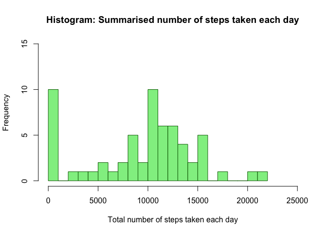
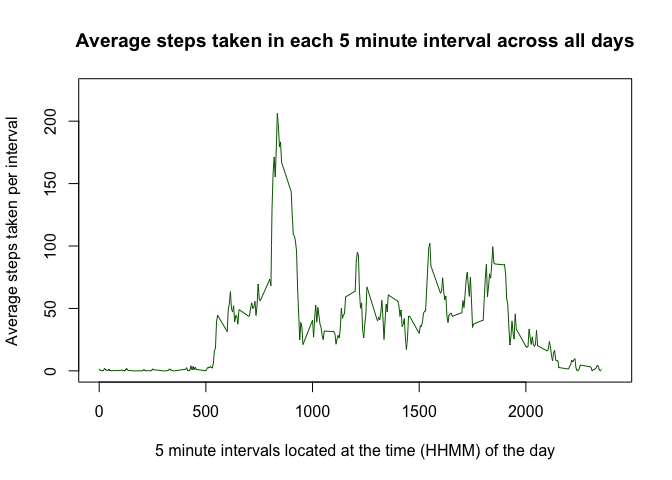
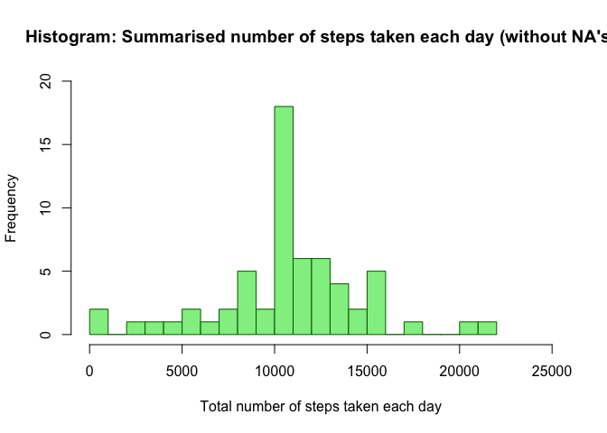
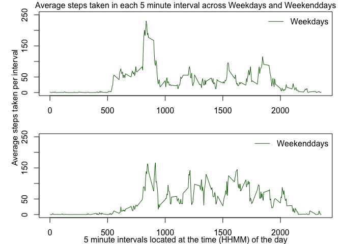

### Loading and preprocessing the data

1.Load the data (i.e. read.csv())

    download.file("http://d396qusza40orc.cloudfront.net/repdata%2Fdata%2Factivity.zip", "activity.zip")
    unzip("activity.zip")
    rawdata <- read.csv("activity.csv", header=TRUE, sep = ",", dec = ".")

2.Process/transform the data (if necessary) into a format suitable for
your analysis

I did not process anything at this stage.

### What is mean total number of steps taken per day?

1.Calculate the total number of steps taken per day

    sumstepsperday <- tapply(rawdata$steps, rawdata$date, FUN=sum, na.rm=TRUE)
    head(sumstepsperday)

    ## 2012-10-01 2012-10-02 2012-10-03 2012-10-04 2012-10-05 2012-10-06 
    ##          0        126      11352      12116      13294      15420

2.Make a histogram of the total number of steps taken each day

    hist(sumstepsperday, breaks=16, col = "lightgreen", border = "darkgreen", ylim=c(0,15), xlim=c(0,25000), xlab="Total number of steps taken each day", main="Histogram: Summarised number of steps taken each day")

3.Calculate and report the mean and median of the total number of steps
taken per day

    mean(sumstepsperday, na.rm=TRUE)

    ## [1] 9354.23

    median(sumstepsperday, na.rm=TRUE)

    ## [1] 10395

The mean of the total number of steps taken each day is 9,354.23, and
median of the total number of steps taken each day is 10,395.

### What is the average daily activity pattern?

1.Make a time series plot (i.e. type = "l") of the 5-minute interval
(x-axis) and the average number of steps taken, averaged across all days
(y-axis)

    meanstepsperinterval <- aggregate(x=list(steps=rawdata$steps), by=list(interval=rawdata$interval),
                          FUN=mean, na.rm=TRUE)
    plot(meanstepsperinterval, type="l", col = "darkgreen",ylim=c(0,225), xlim=c(0,2400), xlab="5 minute intervals located at the time (HHMM) of the day", ylab="Average steps taken per interval", main = "Average steps taken in each 5 minute interval across all days")

2.Which 5-minute interval, on average across all the days in the
dataset, contains the maximum number of steps?

    meanstepsperinterval[which.max(meanstepsperinterval$steps),]

    ##     interval    steps
    ## 104      835 206.1698

The 5 minute interval at 08:35 in the morning is the 5 minute interval
across all days, where the most steps on average were taken, 206.1698
steps.

### Imputing missing values

1.Calculate and report the total number of missing values in the dataset
(i.e. the total number of rows with NAs)

    nas <- is.na(rawdata$steps)
    table(nas)

    ## nas
    ## FALSE  TRUE 
    ## 15264  2304

2.Devise a strategy for filling in all of the missing values in the
dataset.

I replace missing values with the mean value of each 5 minute interval
across all days.

3.Create a new dataset that is equal to the original dataset but with
the missing data filled in.

    process.value <- function(steps, interval) {
        processed <- NA
        if (!is.na(steps))
            processed <- c(steps)
        else
            processed <- (meanstepsperinterval[meanstepsperinterval$interval==interval, "steps"])
        return(processed)
    }
    processed.data <- rawdata
    processed.data$steps <- mapply(process.value, processed.data$steps, processed.data$interval)
    head(processed.data)

    ##       steps       date interval
    ## 1 1.7169811 2012-10-01        0
    ## 2 0.3396226 2012-10-01        5
    ## 3 0.1320755 2012-10-01       10
    ## 4 0.1509434 2012-10-01       15
    ## 5 0.0754717 2012-10-01       20
    ## 6 2.0943396 2012-10-01       25

4.Make a histogram of the total number of steps taken each day

    sumstepsperdayprocessed <- tapply(processed.data$steps, processed.data$date, FUN=sum, na.rm=TRUE)
    head(sumstepsperdayprocessed)

    ## 2012-10-01 2012-10-02 2012-10-03 2012-10-04 2012-10-05 2012-10-06 
    ##   10766.19     126.00   11352.00   12116.00   13294.00   15420.00

    hist(sumstepsperdayprocessed, breaks=16, col = "lightgreen", border = "darkgreen", ylim=c(0,20), xlim=c(0,25000), xlab="Total number of steps taken each day", main="Histogram: Summarised number of steps taken each day (without NA's)")

3.Calculate and report the mean and median of the total number of steps
taken per day

    mean(sumstepsperdayprocessed, na.rm=TRUE)

    ## [1] 10766.19

    median(sumstepsperdayprocessed, na.rm=TRUE)

    ## [1] 10766.19

The "new" mean of the total number of steps taken each day is 10,766.19,
and the "new" median of the total number of steps taken each day is
10,766.19.

Do these values differ from the estimates from the first part of the
assignment? What is the impact of imputing missing data on the estimates
of the total daily number of steps?

Yes, the mean og the median of the processed data deviates from the mean
and the median of the raw data. In the raw data the NA's are set til the
value 0, where as my strategi sets the value af the NA's to mean value
of each 5 minute interval across all days. This "moves" all NA
observations from the very left in a histogram rightwards and increases
both mean and median.

### Are there differences in activity patterns between weekdays and weekends?

For this part the weekdays() function may be of some help here. Use the
dataset with the filled-in missing values for this part.

1.Create a new factor variable in the dataset with two levels --
"weekday" and "weekend" indicating whether a given date is a weekday or
weekend day.

(Note that "Lørdag" and Søndag" are the danish words for "Saturday"
and"Sunday" in english.)

    processed.data$weekday <- weekdays(as.Date(processed.data$date, format = "%Y-%m-%d"))
    processed.data$weekday.type <- factor(ifelse(processed.data$weekday=="Lørdag"|processed.data$weekday=="Søndag", "weekend", "weekday"), levels = c("weekday", "weekend"))
    processed.data$interval <- as.integer(processed.data$interval)
    str(processed.data)

    ## 'data.frame':    17568 obs. of  5 variables:
    ##  $ steps       : num  1.717 0.3396 0.1321 0.1509 0.0755 ...
    ##  $ date        : Factor w/ 61 levels "2012-10-01","2012-10-02",..: 1 1 1 1 1 1 1 1 1 1 ...
    ##  $ interval    : int  0 5 10 15 20 25 30 35 40 45 ...
    ##  $ weekday     : chr  "Mandag" "Mandag" "Mandag" "Mandag" ...
    ##  $ weekday.type: Factor w/ 2 levels "weekday","weekend": 1 1 1 1 1 1 1 1 1 1 ...

2.Make a panel plot containing a time series plot (i.e. type = "l") of
the 5-minute interval (x-axis) and the average number of steps taken,
averaged across all weekday days or weekend days (y-axis).

    weekdaysteps <- processed.data[processed.data$weekday.type == "weekday", ]
    str(weekdaysteps)

    ## 'data.frame':    12960 obs. of  5 variables:
    ##  $ steps       : num  1.717 0.3396 0.1321 0.1509 0.0755 ...
    ##  $ date        : Factor w/ 61 levels "2012-10-01","2012-10-02",..: 1 1 1 1 1 1 1 1 1 1 ...
    ##  $ interval    : int  0 5 10 15 20 25 30 35 40 45 ...
    ##  $ weekday     : chr  "Mandag" "Mandag" "Mandag" "Mandag" ...
    ##  $ weekday.type: Factor w/ 2 levels "weekday","weekend": 1 1 1 1 1 1 1 1 1 1 ...

    weekendsteps <- processed.data[processed.data$weekday.type == "weekend", ]
    str(weekendsteps)

    ## 'data.frame':    4608 obs. of  5 variables:
    ##  $ steps       : num  0 0 0 0 0 0 0 0 0 0 ...
    ##  $ date        : Factor w/ 61 levels "2012-10-01","2012-10-02",..: 6 6 6 6 6 6 6 6 6 6 ...
    ##  $ interval    : int  0 5 10 15 20 25 30 35 40 45 ...
    ##  $ weekday     : chr  "Lørdag" "Lørdag" "Lørdag" "Lørdag" ...
    ##  $ weekday.type: Factor w/ 2 levels "weekday","weekend": 2 2 2 2 2 2 2 2 2 2 ...

    meanweekdaysteps <- aggregate(x=list(steps=weekdaysteps$steps), by=list(interval=weekdaysteps$interval),
                          FUN=mean, na.rm=TRUE)
    meanweekendsteps <- aggregate(x=list(steps=weekendsteps$steps), by=list(interval=weekendsteps$interval),
                          FUN=mean, na.rm=TRUE)
    par(mfrow = c(2,1), mar = c(2.7,4,1.2,1))
    plot(meanweekdaysteps, type="l", col = "darkgreen", ylim=c(0,250), ylab="")
    legend("topright", col=("darkgreen"), lty=c(1),  bty="n", c("Weekdays"))
    plot(meanweekendsteps, type="l", col = "darkgreen", ylim=c(0,250), ylab="")
    legend("topright", col=("darkgreen"), lty=c(1),  bty="n", c("Weekenddays"))
    par(mfrow = c(1,1), mar = c(1,2,1,0))
    mtext(text="5 minute intervals located at the time (HHMM) of the day", side=1)
    mtext(text="Average steps taken per interval", side=2)
    mtext(text="Average steps taken in each 5 minute interval across Weekdays and Weekenddays", side=3)

Yes, there are differences in activity patterns between weekdays and
weekend days. People tend to be more active in mornings on weekdays,
where as they are more active around midday and in the afternoons on
weekend days. Just before 20:00 (8:00 PM) people are more active on
weekdays, where as they are slightly more active just after 20:00 (8:00
PM) on weekend days.
